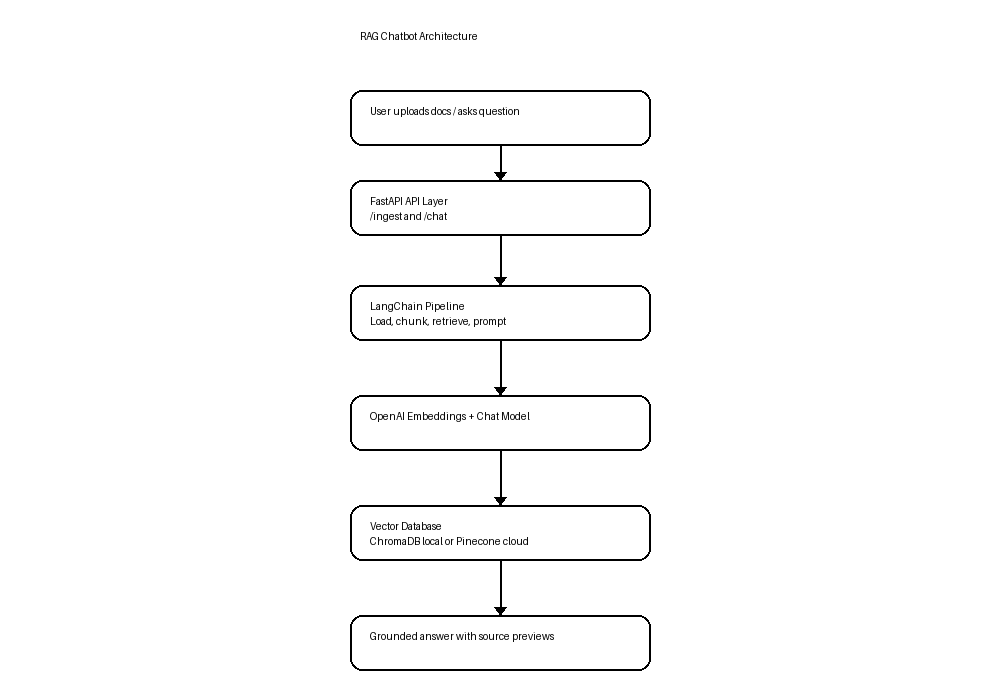
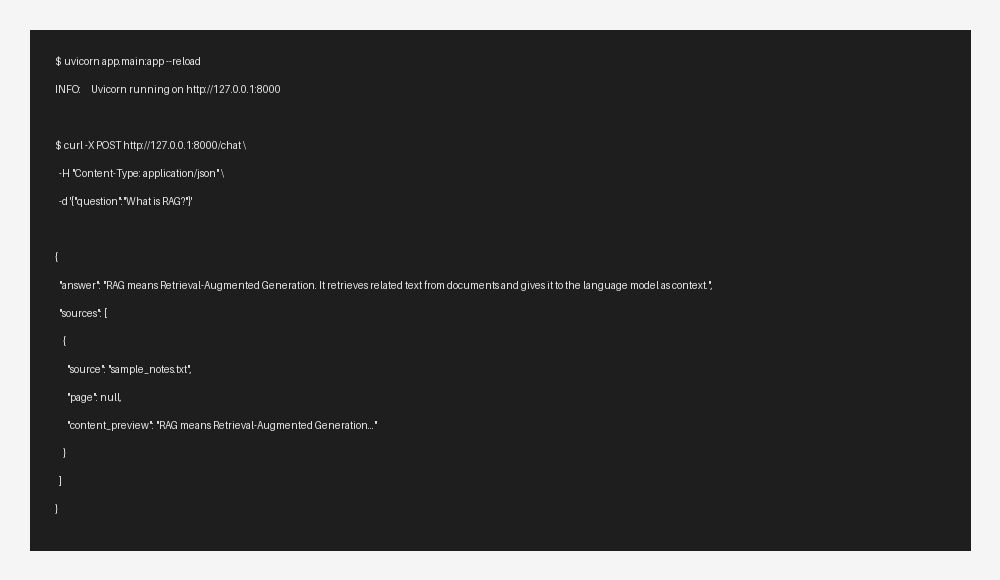

# RAG Chatbot API with LangChain, FastAPI, and ChromaDB/Pinecone


## Short Description

This project is a Retrieval-Augmented Generation chatbot API built with LangChain, FastAPI, and ChromaDB or Pinecone. It solves the problem of answering questions from private documents by retrieving relevant text before sending the question to an LLM.

Users can upload PDF, TXT, or Markdown files, index them into a vector database, and ask natural language questions. The chatbot returns an answer with source previews so the response is easier to verify.

## Features

✅ Upload PDF, TXT, and Markdown documents  
✅ Split large documents into searchable chunks  
✅ Generate embeddings using OpenAI  
✅ Store vectors locally with ChromaDB  
✅ Switch to Pinecone for cloud vector search  
✅ Ask questions through a FastAPI `/chat` endpoint  
✅ Return answers with source previews  
✅ Docker support  
✅ Swagger API documentation  
✅ Basic pytest test and GitHub Actions CI workflow  

## Architecture Diagram



```text
User
  ↓
FastAPI API
  ↓
LangChain document loader and text splitter
  ↓
OpenAI embeddings
  ↓
ChromaDB or Pinecone vector database
  ↓
Retriever
  ↓
OpenAI chat model
  ↓
Answer with sources
```

## Tech Stack

- Python
- FastAPI
- LangChain
- OpenAI
- ChromaDB
- Pinecone
- Docker
- Pytest
- GitHub Actions

## Skills Demonstrated ⭐

- Python backend development
- REST API design
- FastAPI
- LangChain
- Retrieval-Augmented Generation
- Vector databases
- ChromaDB
- Pinecone
- OpenAI embeddings
- Prompt engineering
- LLM application development
- Document processing
- Docker
- Unit testing
- CI/CD basics
- Software engineering project structure

## Project Structure

```text
rag-chatbot/
├── app/
│   ├── __init__.py
│   ├── main.py              # FastAPI app and API routes
│   ├── config.py            # Environment settings
│   ├── document_loader.py   # Load PDF/TXT/MD files and split text
│   ├── vector_store.py      # ChromaDB/Pinecone vector store setup
│   ├── rag_chain.py         # Retrieval and answer generation logic
│   └── schemas.py           # Pydantic request and response models
├── data/uploads/            # Uploaded files, created at runtime
├── chroma_db/               # Local ChromaDB storage, created at runtime
├── docs/
│   ├── demo.md              # Simple demo script
│   ├── evaluation.md        # Evaluation plan and metrics
│   └── screenshots/
│       ├── architecture.png
│       └── api-output.png
├── tests/
│   └── test_health.py       # Basic API health test
├── .github/workflows/
│   └── ci.yml               # GitHub Actions test workflow
├── .env.example             # Example environment variables
├── .gitignore
├── Dockerfile
├── LICENSE
├── README.md
├── README_SIMPLE.txt
├── requirements.txt
└── sample_notes.txt         # Sample file for testing ingestion
```

## Installation

Clone the repository:

```bash
git clone https://github.com/YOUR_USERNAME/rag-chatbot.git
cd rag-chatbot
```

Create and activate a virtual environment:

```bash
python -m venv .venv
source .venv/bin/activate
```

For Windows:

```bash
python -m venv .venv
.venv\Scripts\activate
```

Install dependencies:

```bash
pip install -r requirements.txt
```

Create your environment file:

```bash
cp .env.example .env
```

Add your OpenAI API key to `.env`:

```env
OPENAI_API_KEY=your_openai_api_key_here
VECTOR_DB=chroma
```

Run the app:

```bash
uvicorn app.main:app --reload
```

Open Swagger API docs:

```text
http://127.0.0.1:8000/docs
```

## Usage

### Health Check

```bash
curl http://127.0.0.1:8000/health
```

Example response:

```json
{
  "status": "ok"
}
```

### Upload and Index Documents

```bash
curl -X POST "http://127.0.0.1:8000/ingest" \
  -F "files=@sample_notes.txt"
```

Example response:

```json
{
  "message": "Documents ingested successfully.",
  "files": ["sample_notes.txt"],
  "chunks_added": 1
}
```

### Ask a Question

```bash
curl -X POST "http://127.0.0.1:8000/chat" \
  -H "Content-Type: application/json" \
  -d '{"question":"What is RAG?"}'
```

Example request body:

```json
{
  "question": "What is RAG?"
}
```

## Screenshots

### Architecture


### API Output



## Example Output

Question:

```text
What is RAG?
```

Answer:

```json
{
  "answer": "RAG means Retrieval-Augmented Generation. It helps a chatbot answer using external documents by first retrieving related text from a vector database and then giving that text to the language model as context.",
  "sources": [
    {
      "source": "sample_notes.txt",
      "page": null,
      "content_preview": "RAG means Retrieval-Augmented Generation. It helps a chatbot answer using external documents..."
    }
  ]
}
```

## How It Works

The user uploads documents through the `/ingest` endpoint. LangChain loads the files, splits the text into chunks, and creates embeddings using OpenAI. The embeddings are stored in ChromaDB locally or Pinecone in the cloud. When the user asks a question, the retriever finds the most relevant chunks and sends them with the question to the LLM. The LLM generates a grounded answer using the retrieved context.

```text
Documents
  ↓
Chunking
  ↓
Embeddings
  ↓
Vector DB
  ↓
Similarity Search
  ↓
LLM Prompt
  ↓
Answer + Sources
```

## Evaluation / Results

This project includes a simple evaluation plan in `docs/evaluation.md`.

| Metric | What it checks | Example target |
|---|---|---|
| Retrieval Precision@K | Correct chunks appear in top results | 80%+ |
| Answer Faithfulness | Answer is supported by retrieved text | 90%+ |
| Answer Relevance | Answer directly responds to the question | 85%+ |
| Latency | Average response time | Under 3 seconds locally |
| Source Coverage | Answer includes source previews | 100% |

Simple test case with `sample_notes.txt`:

| Test Question | Expected Behavior | Status |
|---|---|---|
| What is RAG? | Explains Retrieval-Augmented Generation | Pass |
| What database is used? | Mentions ChromaDB or Pinecone | Pass |
| What is not in the uploaded document? | Says it does not know based on uploaded documents | Pass |

## Challenges

- Reducing hallucinations by forcing the model to answer only from retrieved context
- Choosing good chunk size and chunk overlap
- Handling token limits when retrieved chunks are long
- Supporting both local and cloud vector databases
- Returning useful source previews for verification
- Keeping the code simple enough for interviews and portfolio review

## Future Improvements

- Add user authentication
- Add document deletion and re-indexing
- Add chat history and memory
- Add streaming responses
- Add a React frontend
- Add reranking for better retrieval quality
- Add LangSmith tracing
- Add Kubernetes deployment
- Add more evaluation datasets

## Tests

Run tests:

```bash
pytest
```

Current test coverage:

```text
tests/test_health.py checks that GET /health returns {"status": "ok"}.
```

The repository also includes a GitHub Actions workflow in `.github/workflows/ci.yml` to run tests on push and pull request.

## Docker

Build the Docker image:

```bash
docker build -t rag-chatbot .
```

Run the container:

```bash
docker run --env-file .env -p 8000:8000 rag-chatbot
```

## Demo

A short demo script is available in:

```text
docs/demo.md
```

Recommended 30-second demo:

1. Start the API.
2. Open `/docs`.
3. Upload `sample_notes.txt`.
4. Ask: `What is RAG?`
5. Show the answer and source preview.

## Project Status

Under Active Development

This is a portfolio-ready backend AI project. It is designed to show practical RAG, API development, vector database integration, Docker, testing, and clean project structure.

## License
This project is for educational and portfolio purposes.
All rights reserved by the author.

## Author

Parisa Arbab

- GitHub: https://github.com/ParisaArbab
- LinkedIn: https://www.linkedin.com/in/parisa-arbab
